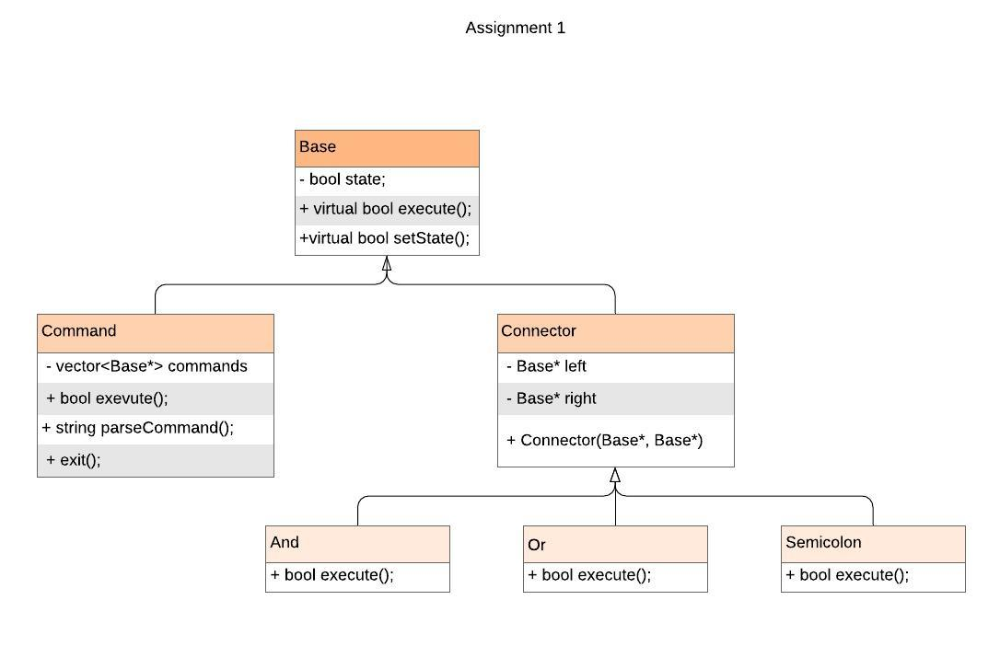
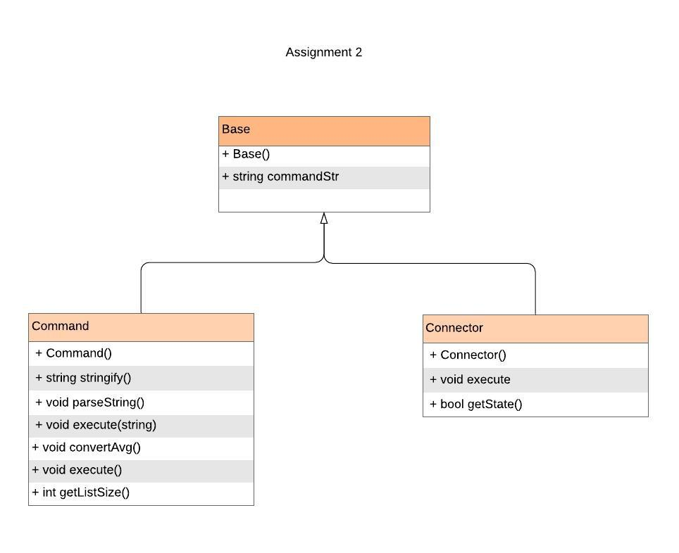

# CS 100 Programming Project

## Personal Information
2019 Fall <br />
Tzu-Ying Chuang, 862080741, tchua006@ucr.edu <br />
Kenta Kawajiri, 862189492, kkawa031@ucr.edu <br />

## Introduction
We are using composite pattern to represent the command and connectors in the program.<br />
The program will read an input from the user and will send it into the command class. Then, the command class will parse the input and splits it into the actual command(s) and connector(s). After that we will send the command(s) to the corresonding connector class. <br />

In Assignment 2, we are building our own command shell. First, the program will print out `$`, and read in the commands from the user. Then, it will delete everything after`#`, which are comments. Next, the program will parse the input while read in `;`, and execute them. While executing, when it read `&&` or `||`, it will sends the command to connector class and allow it to find out it's state.<br />

In Assignment 3, we expended what we did in Assignment 2 and add in test command and parentheses in order to change the precedence of the commands.<br />

In Assignment 4, we are supposed to expended the program and let the program to allow input redirection `<`, output redirection `>` and `>>`, and pipe `|`. <br />

## Code Example

### Comment
```bash
$ ls -a; # this is a comment
```
It will only execute `ls -a` and ignore things after `#`.

### Semicolon
```bash
$ ls -a; echo hello
```
`;` will execute both whatever the first command is true or false. In this case, it will execute `ls -a` and `echo hello`.

### And
```bash
$ ls -a && echo hello
```
`&&` will execute the second command when the first command is true, which means when the first command is false, the second command will not execute. In this case, it will execute `ls -a` and `echo hello`.

### Or
```bash
$ ls -a || echo hello
```
`||` will not execute the second command when the first command is true, which means when the first command is false, the second command will execute. In this case, it will only execute `ls -a`.

### Combination
```bash
$ ls -a; echo hello && mkdir test || echo world; git status
```
In this case, it will execute `ls -a`, `echo hello`, `mkdir test`, and `git status`.

### Test Command
```bash
$ test -e ../header/base.hpp
```
or
```bash
$ [ -e ../header/base.hpp ]
```
In both cases, the program is supposed to print `(TRUE)` or `(FALSE)` if the file exists.

### Parentheses
```bash
$ (echo A && echo B) || (echo C && echo D)
```
This is going to print out 
```bash
A
B
```

## Diagram



## Classes

* Base class: This is our first step to separte objects into tree structures to represent the hierarchies. We have `bool state`, `virtual bool execute()`, and `virtual bool setState()` functions. This class will take the input from the user and send it to the composite class.

* Command class: This class is to manage the information we pass down from base class. We have `vector<Base*> commands`, `bool execute()`, `string parseCommand()`, and `exit()`. This class will parse the string and store them into vector. When we read `exit` from the string, it will exits the program.


## Prototypes/Research

### execvp()
`execvp()` allows a progress to run any program, which include a binary executbale or a shell script.
```
#include <iostream>
#include <unistd.h>
#include <string>
#include <cstring>
using namespace std;
int main()
{
    string arg1("cat");
    string arg2("example.txt");
    char* arg[3] = {strdup(arg1.c_str()), strdup(arg2.c_str()), NULL};    
    //strdup() returns a pointer to a null-terminated byte string
    execvp(arg[0],arg);
}
```
This allows the program to create an example.txt file.<br />
We are going to use this function to run the user's input.

### fork()
`fork()` will creates a new process by duplicating the calling process. The new one will be called as a child process, while the other we just called it the parent process. The child and parent processes will run in separate memory spaces. The difference from each of the leaf classes is that they excute differently depending on the state of the execution.
```
#include <iostream>
#include <stdio.h> 
#include <sys/types.h> 
#include <unistd.h> 
using namespace std;
int main()
{
    fork();
    cout << "Hello" << endl;
}
```
The result will be 
```
Hello
Hello
```

### waitpid()
`waitpid()` suspends the calling process until a specified process terminates, which usually works with `fork()`. If the specified process has already ended when the waitpid function is called and the system has status information, the return from waitpid occurs immediately. A return from the waitpid function also occurs if a signal is received and is not ignored.
```
#include <cstdlib>
#include <string>
#include <sys/types.h>
#include <sys/wait.h>
#include <iostream>
#include <cstdio>
#include <unistd.h>
using namespace std;

int main(int argc, char** argv) 
{
    pid_t child;
    child = fork();
    if(child == 0)
    {
        cout << "This is child process" << endl;
        sleep(5);
        cout << "Child process" << endl;
    }
    else
    {
        cout << "This is parent process" << endl;
        waitpid(child, NULL, 0);
        cout << "Parent process" << endl;
    }
    return 0;
}
```
The result will be
```
This is child process
This is parent process
(Wait for 5 seconds)
Child process
Parent process
```

### stat()
The `stat()` function allows us to know if the file exiest or not, or if it is a directory or not.
```
#include <sys/types.h>
#include <sys/stat.h>
#include <unistd.h>
#include <iostream>
using namespace std;
int main(int argc, char** argv) 
{
    char flag = 'e';
    if(strncmp(argv[0], "[", 1) == 0)
    {
        argv.erase(argv.end() - 1);
    }
    argv.erase(argv.begin());
    flag = argv[0][1];
    struct stat buf;
    int i = stat(argv[1], &buf);
    if(flag == 'e')
    {
        if(S_ISDIR(buf.st_mode) || S_ISREG(buf.st_mode))
        {
            cout << "(TRUE)" << endl;
            exit(0);
        }
        else
        {
            cout << "(FALSE)" << endl;
            _exit(1);
        }
    }
    else if(flag == 'f')
    {
        if(S_ISREG(buf.st_mode))
        {
            cout << "(TRUE)" << endl;
            exit(0);
        }
        else
        {
            cout << "(FALSE)" << endl;
            _exit(1);
        }
    }
    else if(flag == 'd')
    {
        if(S_ISDIR(buf.st_mode))
        {
            cout << "(TRUE)" << endl;
            exit(0);
        }
        else
        {
            cout << "(FALSE)" << endl;
            _exit(1);
        }
    }
}
```
If we type in the below into the program:
```
test -e ../header/base.hpp
```
the output should be 
```
(TRUE)
```


## Development and Testing Roadmap

During the process of Assignment 2, we have decided to do the program in different process, so we have closed most of the issues since they are not related to our current idea. (See Diagram)<br />

In Assignment 3, we are going to do separate the work into two parts, the test command and parentheses. First, we will work on the test command and make sure it is giving the correct output. Then we will cut the commands based on the parentheses and did the execution of the commands based on the precedence order.<br />

## Known Bugs

Pipe is not working.<br />

The program basically just copy the input file. After input and output file, the program will ignore the rest of the command.<br />
